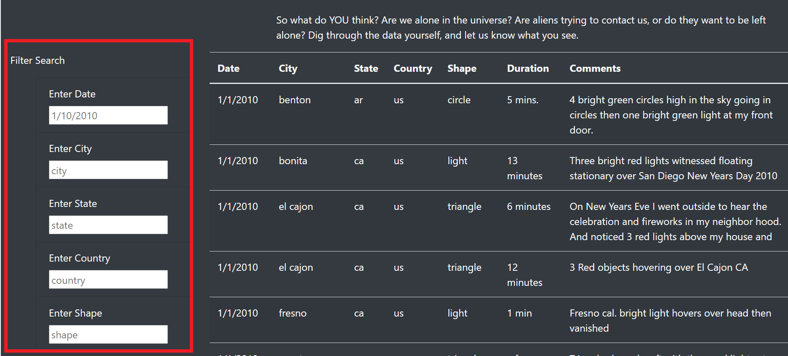

# **UFO Project** 

## **UFO Project Overview:** 
The purpose of this analysis is to provide a more in-depth analysis of UFO sightings by allowing users to filter for multiple criteria at the same time. In addition to the date, filters were added for the city, state, country, and shape.

## **UFO Project Results:** 

To utilize this webpage, the user would scroll down to the Filter Search Section and enter whatever filter criteria they so choose.

For example if the user would like to see all UFO sightings from the state of TX.  The user would input tx into the Enter State box.
Images/UFO_TX.PNG

The user can further filter this information by adding addtional criteria in the other filter boxes.  For instance, if the user wanted to see all UFOs spotted in TX on 1/8/2010, they would add 1/8/2010 into the Date filter box.
Images/UFO_TX_Date.PNG

## **UFO Project Summary:** 
In a summary statement, describe one drawback of this new design and two recommendations for further development.
One drawback of this design, is that people may be expecting a button to execute the command.
I would also recommend a button that clears the criteria and 
