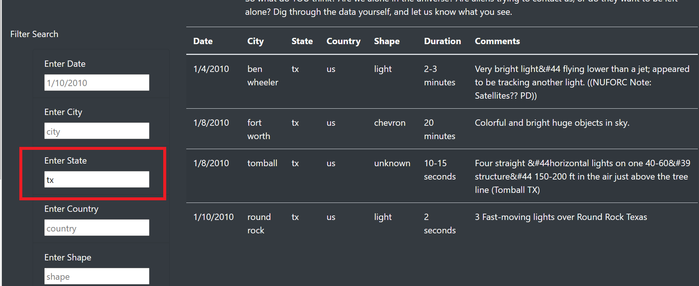
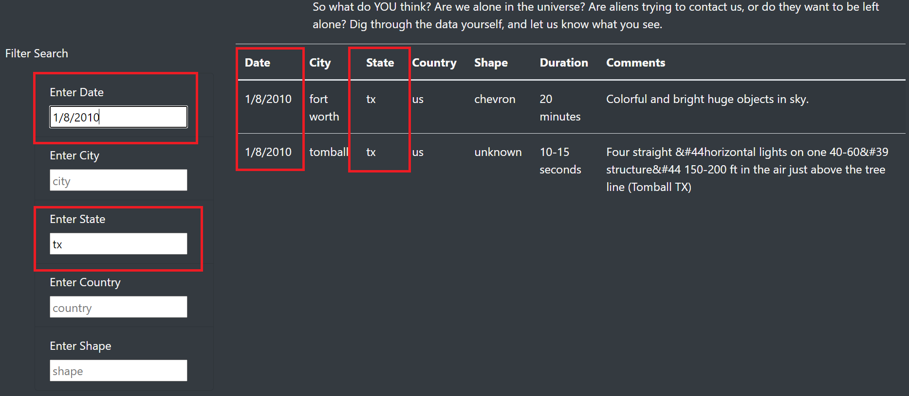

# **UFO Project** 

## **UFO Project Overview:** 
- The purpose of this analysis is to provide a more in-depth analysis of UFO sightings by allowing users to filter for multiple criteria at the same time.  In addition to the date, filters were added for the city, state, country, and shape.

## **UFO Project Results:** 

- To utilize this webpage, the user would scroll down to the "Filter Search" section and enter whatever filter criteria they so choose.

  

- For example, if the user would like to see all UFO sightings from the state of TX.  The user would input "tx" into the "Enter State" box.
  
  

- The user can further filter this information by adding additional criteria in the other filter boxes.  For instance, if the user wanted to see all UFOs spotted in TX on 1/8/2010, they would add the additional criteria “1/8/2010” into the “Enter Date” box.
  
  

## **UFO Project Summary:** 
- One drawback of this design, is that the user must type in the criteria exactly.  The user may make a mistake, add a date, city, etc. where there was no sighting, capitalize a state abbreviation like "TX" instead of how it appears in the data "tx," and end up getting no results.  
- One recommendation would be to have drop down menus/lists to assist the user when choosing their criteria.  
- Also, I would recommend adding a button that executes the criteria and clears the criteria.
